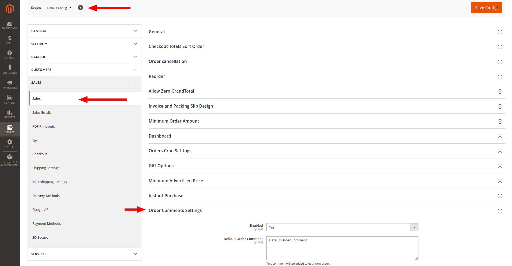
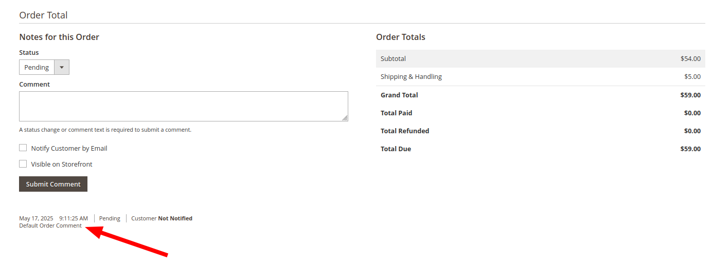

# YellowCard Order Comment Processing

## Requirements
(developed and tested on)

- Magento 2.4.7-p4
- PHP 7.4
- RabbitMQ set up and configured as a message broker

## Installation

1. Place module files in the following directory:
   ```
   app/code/YellowCard/OrderCommentProcessing
   ```

2. Enable the module by running:
   ```bash
   bin/magento module:enable YellowCard_OrderCommentProcessing
   ```

   Alternatively, add it manually to `app/etc/config.php` in the modules list:
   ```php
   'YellowCard_OrderCommentProcessing' => 1,
   ```

3. The module is **enabled by default** in the admin panel.  
   If you do **not** want to add comments to orders, simply disable it from the admin panel.

## Configuration

1. Set the comment you would like to add to orders in the **Default scope**:
   ```
   Stores -> Configuration -> Sales -> Sales -> Order Comments Settings
   ```

2. Update the field **"Default Order Comment"** with your desired comment.

3. Save the configuration.  
   This comment will be applied to **all orders** across every website/store/store view.

## Queue Consumer Registration

Register the new consumer responsible for handling comment addition.

### Option 1: Configure in `env.php`

Add the following under the `cron_consumers_runner` node → `consumers`:
```php
'yellowcardOrderComment.consumer.one'
```

Make sure cron is running and properly configured.  
More info: [Manage Message Queues](https://experienceleague.adobe.com/en/docs/commerce-operations/configuration-guide/message-queues/manage-message-queues#behavior-by-default)

### Option 2: Run Manually in Command Line
(mostly for testing purposes)

```bash
php bin/magento queue:consumers:start yellowcardOrderComment.consumer.one
```

## Final Steps

1. Run setup upgrade:
   ```bash
   bin/magento setup:upgrade
   ```

2. Place an order — the configured comment should be added to the order's comment history.  
   **Note:** The customer will **not** be notified about the added comment.




